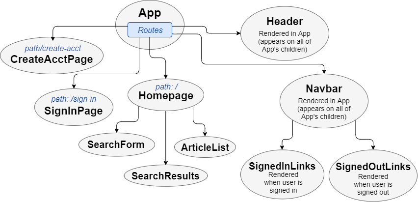

# _YARP_

#### _Yepicodus Academic Research Portal, 5 Jan 2020_

#### By _**Jacqueline Remmel and Mike McShane**_

## Description

This app allows the user to enter a search term to browse articles from the [CORE API](https://core.ac.uk/ "CORE Homepage"). The user can thens save an article from the search results to the "My Articles" list. The user can also view the article's details or remove articles from their list.

React component structure:

 

## Setup/Installation Requirements

* Clone this repository
* Navigate to the project directory, "yarp2.0"
* Run the command "npm install"
* Configure your CORE API key:
  * Locate your CORE API key, or go to https://core.ac.uk/services/api/ and select "Apply for a free API key" to obtain one
  * In the "yarp2.0" project directory, create a file called ".env"
  * Open the .env file and store your API key using the following format:
    ```javascript
    API_KEY = your-API-key-here
    ```
  * Save the .env file
* Configure Firebase & Firestore:
  * Create a file called "firebaseConfig.js" located in the "src/constants" directory
  * Log in to your account at https://firebase.google.com/ and create a project that uses Cloud Firestore
  * Go to your project's settings, locate the "Firebase SDK snippet" section, and switch to the "Config" option
  * Copy and paste your project's Firebase config code into the newly created firebaseConfig.js file, using the following format:
    ```javascript
    const firebaseConfig = {
      apiKey: 'YOUR-UNIQUE-CREDENTIALS',
      authDomain: 'YOUR-PROJECT-NAME.firebaseapp.com',
      databaseURL: 'https://YOUR-PROJECT-NAME.firebaseio.com',
      projectId: 'YOUR-UNIQUE-PROJECT-NAME',
      storageBucket: 'YOUR-UNIQUE-URL',
      messagingSenderId: 'YOUR-UNIQUE-CREDENTIALS',
      appId: 'YOUR-UNIQUE-APP-INFO',
      measurementId: 'YOUR-UNIQUE-APP-INFO'
    };

    export default firebaseConfig;
    ```
  * Save the firebaseConfig.js file
* Run the command "npm run start"
* Go to the URL "http://localhost:8080/" in a browser

## Technologies Used

* JavaScript
* React
* Redux
* Thunk
* React Router
* Materialize CSS
* HTML
* Node.js
* Webpack
* Firebase/Cloud Firestore

### License

*Open-source*

Copyright (c) 2019 **_Jacqueline Remmel and Mike McShane_**